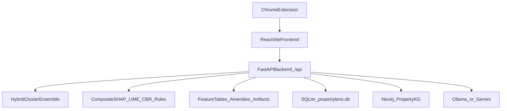

## PropertyLens — LLM context (project brief)

### What this project is
Full-stack app for **Singapore HDB resale pricing** with explainability:
- **Predict** a fair resale price from a small set of user inputs.
- **Explain** the prediction via Composite TreeSHAP (default), LIME, CBR comparables, Apriori + surrogate rules.
- **Help workflows** for personas: Buyer, Seller, Shortlist (saved listings), Analytics, Property Search AI.
- **Chrome extension** to deep-link PropertyGuru listings into the Buyer flow.

### Core user experiences
- **Buyer**: prediction + composite SHAP drivers + comparables + map + offer-planner card with bands anchored on AI/comps.
- **Seller**: prediction + asking-price recommendation + what-if + counterfactual + offer-handler card with live verdict and dynamic counter math.
- **Shortlist**: Versus head-to-head — apple-to-apple filter, AI-vs-asking comparison, slot-coloured map pins, full-height map with highways and amenity radii.
- **Analytics**: full-width waterfall SHAP chart (Composite TreeSHAP), cluster filter with human-readable labels.
- **Ask AI / Property Search**: Neo4j knowledge graph + Ollama (`gemma3`) for natural-language property search.

### High-level architecture

### Repository layout (important folders)
- **`backend/`**: FastAPI app (prediction + explainability + wishlist/history/auth + Neo4j-backed chat).
- **`frontend/`**: Vite + React UI for Buyer/Seller/Shortlist/Analytics/Property Search.
- **`extension/`**: Chrome extension content script (PropertyGuru → Buyer view).
- **`notebooks/`**: training pipelines + 4 SHAP notebooks (kernel, composite, permutation) + photo layer + 06 search layer.
- **`scripts/`**: standalone CLI tools (rule miner, retrain, CBR rebuild).
- **`data/`** (gitignored except amenities):
  - `data/artifacts/`: model bundle + XAI artifacts (from HF)
  - `data/feature_data/.../outputs/`: feature tables (from HF)
  - `data/amenities/`: amenity CSVs (in git)
  - `data/propertylens.db`: SQLite (auth, prediction history, wishlist) — created by setup notebook
- **`hf_data/05_photo_layer/artifacts/`**: photo condition model `.pth` (from HF)
- **`HOW_TO_RUN.md`** + **`.env.example`** at repo root: complete setup guide and env template.
- **`upload_artifacts_to_hf.ipynb`** / **`download_artifacts_from_hf.ipynb`** / **`setup_neo4j_and_db.ipynb`** at repo root: HF + DB setup notebooks.

### Backend (FastAPI) overview
Entry: `backend/main.py`. Loads artifacts at startup into shared `state`:
- Hybrid bundle, CBR (tree + scaler + parquet + features), LIME training data
- `global_shap_cache.json` (legacy tree-only)
- `global_shap_by_cluster.json` (per-cluster legacy)
- `composite_treeshap_global_importance.json` (composite — preferred)
- `cluster_profiles.json` (human-readable cluster labels)
- `rules.json`, `hybrid_cluster_meta.json`

Key APIs (mounted under `/api`):
- **Prediction**: `POST /predict` → price + confidence + debug + location.
- **Explainability**: `POST /explain/shap`, `POST /explain/composite-shap`, `POST /explain/lime`, `POST /cbr/similar`, `POST /counterfactual`, `GET /rules`.
- **Analytics**: `GET /analytics/trends`, `GET /analytics/global-shap?source=composite|tree-only` (default composite when artifact present), `GET /analytics/recent-transactions`.
- **Location**: `GET /geocode`, `GET /nearby` (uses `data/amenities/*.csv`).
- **Chat / search**: `POST /chat` (Neo4j-backed Q&A), `POST /property-search-chat` (NL property search streaming).
- **Photo**: `POST /predict/condition-photo` (EfficientNet-B0).
- **Persistence**: `/history/*`, `/wishlist/*`. **Auth**: `/auth/*` (JWT, demo `user`/`1234`).

### Removed: Pinecone "Ask AI (beta)" feature
The Pinecone-based `/api/rag-chat` endpoint and `backend/rag_v51/` package were removed. The Neo4j-based property-search chat (`/api/property-search-chat`) replaces it. `chat_tools.py` was kept (still used by property-search). The notebooks under `notebooks/05_chatbot/` that build the Pinecone index were retained for reference.

### Model + composite SHAP
**Hybrid Cluster Ensemble**: K-means routes flats to 4 clusters; per-cluster Ridge + XGB + LGB + RF blended by linear meta-learner with weights `[w_ridge, w_xgb, w_lgb, w_rf]`.

**Composite TreeSHAP** (`backend/composite_treeshap.py`) — exact for the tree portion of the stack:
- `phi = w_xgb·sv_xgb + w_lgb·sv_lgb + w_rf·sv_rf`, base `= w_xgb·E_xgb + w_lgb·E_lgb + w_rf·E_rf + meta_intercept`
- Ridge component dropped — surfaced as a small reconciliation gap (`ridge_gap_pct_of_pred`, ~5–7%).
- Global aggregate built by `notebooks/04_xai_layer/07_composite_treeshap.ipynb` (cluster-stratified N=2000 sample from train+test) and saved to both notebook + `data/artifacts/hybrid_xai/` paths.

### Frontend overview (React/Vite)
Core views under `frontend/src/views/`:
- `BuyerView.jsx`: parallel predict + SHAP + CBR; sequential geocode/nearby; renders `BuyerEstimateInsights` with `CompositeShapPanel`. Floating "Plan your offer" CTA opens `BuyerOfferPlannerCard` (Step 5).
- `SellerView.jsx`: predict + SHAP + CBR + counterfactual + trends + what-if. Floating "Got an offer?" CTA opens `OfferHandlerCard` (Step 6) with live verdict + dynamic counter-offer math.
- `ShortlistView.jsx`: Versus head-to-head only (Pin Map sub-tab removed). Apple-to-apple filter, scorecard, picker chips, AI-vs-asking comparison, full-height map with highways + 1km/2km amenity radii.
- `AnalysisView.jsx`: full-width waterfall SHAP chart, top-10 features only, plain-English labels (`prettifyFeatureLabel`), cluster dropdown with multi-line items showing label + summary + top towns.
- `PropertySearchAIView.jsx`: NL property search with streaming responses + `PropertySearchGraph` visualization.

Shared API client: `frontend/src/api/client.js`.

### Extension integration (PropertyGuru → Buyer)
Extension reads PropertyGuru HDB listing → POSTs to `http://localhost:8000/api/predict` → "Open in Buyer" deep-links to `http://localhost:5173/buyer?...&asking_price=...`. **Frontend must run on port 5173 exactly** (`npm run dev -- --port 5173 --strictPort`).

### Local dev quick start (typical)
1. `download_artifacts_from_hf.ipynb` → pulls ~1.5 GB into `data/` and `hf_data/`.
2. `setup_neo4j_and_db.ipynb` → seeds Neo4j (Property/Town/FamousSchool from layer 06) + SQLite + demo user.
3. `ollama serve && ollama pull gemma3`.
4. `cd backend && uvicorn main:app --reload --port 8000`.
5. `cd frontend && npm run dev -- --port 5173 --strictPort`.

Full guide: `HOW_TO_RUN.md` at repo root.

### Hugging Face repos
- **`PropertyLens/final-propertylens-models`** (model) — `data/artifacts/**` + photo `.pth`.
- **`PropertyLens/final-dataset`** (dataset) — `data/feature_data/**` + raw schooling extract.
