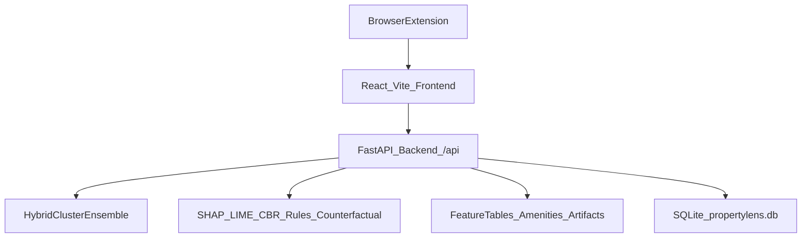

## PropertyLens — LLM context (project brief)

### What this project is
PropertyLens is a full-stack app for **Singapore HDB resale pricing** and explainability:
- **Predict** a fair resale price from a small set of user inputs.
- **Explain** the prediction using multiple XAI tools (SHAP, LIME, rules, comparables).
- **Help workflows** for different personas: Buyer, Seller, Shortlist (saved listings), plus supporting pages.
- Optional browser **extension** to deep-link PropertyGuru listings into the Buyer flow.

### Core user experiences
- **Buyer**: “Is this asking price fair?” → predicts price, shows confidence band, SHAP drivers, comparable sales (CBR), negotiation guidance, and a location/amenities map.
- **Seller**: “What should I list at?” → predicts price, provides trends context, what-if sliders, counterfactual negotiation range, CSP/constraints checks.
- **Shortlist**: Save listings with frozen snapshots (prediction + SHAP + CBR + map), then rank/filter and compare.

### High-level architecture

### Repository layout (important folders)
- **`backend/`**: FastAPI app (prediction + explainability + wishlist/history/auth).
- **`frontend/`**: Vite + React UI for Buyer/Seller/Shortlist/etc.
- **`data/`**: downloaded artifacts & datasets (often gitignored when large).
  - `data/artifacts/`: model bundle + XAI artifacts
  - `data/feature_data/.../outputs/`: feature tables (CSV)
  - `data/amenities/`: amenity CSVs used for “nearby”
  - `data/propertylens.db`: SQLite (auth, prediction history, wishlist)
- **`notebooks/`**: setup + training + feature engineering + XAI pipelines.
- **`docs/views-developer-guide.md`**: detailed frontend flow notes (Buyer/Seller/Shortlist).
- **`extension/`**: PropertyGuru content script that opens Buyer view with URL params.

### Backend (FastAPI) overview
Entry point: `backend/main.py`
- Loads artifacts once at startup into a shared `state` (model bundle, SHAP caches, rules, CBR data).
- Exposes `/api/*` routes and a `/health` endpoint.

Key APIs (shape-level)
- **Prediction**
  - `POST /api/predict` → price estimate + confidence band + debug + location context
- **Explainability**
  - `POST /api/explain/shap` → local SHAP (fallback to cached global SHAP if needed)
  - `POST /api/explain/lime` → LIME explanation
  - `POST /api/cbr/similar` → similar historical cases (BallTree over CBR feature subset)
  - `POST /api/counterfactual` → negotiation range based on asking vs estimate
  - `GET  /api/rules` → apriori + surrogate rule sets (from cached artifacts)
- **Analytics**
  - `GET /api/analytics/trends` → median price by year (optional town filter)
  - `GET /api/analytics/global-shap` → cached global mean(|SHAP|) importances (optional per cluster)
- **Location**
  - `GET /api/geocode` → OneMap geocode proxy
  - `GET /api/nearby` → amenities within radius using `data/amenities/*.csv`
- **Persistence (SQLite)**
  - `POST /api/history/prediction` and `GET /api/history/predictions`
  - `POST /api/wishlist/items`, `GET /api/wishlist/items`, `GET /api/wishlist/items/{id}`, `DELETE /api/wishlist/items/{id}`
- **Auth**
  - `/api/auth/*` (JWT-based demo auth)

### Model + data (how prediction works)
The backend uses a **Hybrid Cluster Ensemble**:
- Inputs come from a **`PredictRequest`**-shaped payload built in the frontend.
- If address fields are present, backend performs a **feature-table lookup** keyed by `block + street + town + sale_month` to align with training distributions and CBR cases.
- Main artifacts are loaded from `data/artifacts/` (configurable via env).

### Frontend overview (React/Vite)
Core pages live under `frontend/src/views/`:
- `BuyerView.jsx`: orchestrates calls to predict + SHAP + CBR (parallel), then geocode/nearby (sequential), then renders `BuyerEstimateInsights`.
- `SellerView.jsx`: orchestrates predict + SHAP + CBR + counterfactual, trends, what-if, CSP validation.
- `ShortlistView.jsx`: loads wishlist rows and enriches each with snapshots and “Smart Score”.

Shared “API client” helpers: `frontend/src/api/client.js`

### Extension integration (PropertyGuru → Buyer)
The extension opens the web app Buyer route with query params:
- `http://localhost:5173/buyer?...&asking_price=...`
BuyerView reads these URL params to prefill the form and optionally auto-run an estimate.

### Local dev quick start (typical)
- Backend:
  - `cd backend && uvicorn main:app --reload --port 8000`
- Frontend:
  - `cd frontend && npm install && npm run dev` (typically `http://localhost:5173`)

