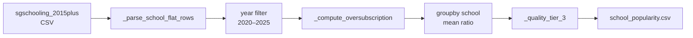

# How `label_school_popularity.py` ranks primary schools

Reference: `[backend/label_school_popularity.py](./label_school_popularity.py)`

## The signal: Phase 2C oversubscription

Singapore's P1 registration runs in sequence: **Phase 1 → 2A → 2B → 2C → 2C(S) → 3**.
Earlier phases are reserved for alumni, siblings, and volunteers; **Phase 2C is
the first phase open to the general public**. How full the school already is
when 2C opens is the cleanest public-facing popularity signal:

- A school that fills Phase 1 / 2A / 2B and spills over into 2C with many
extra applicants is sought-after. Parents must ballot, and properties within
1 km command a price premium.
- A school that still has empty seats in 2C (and sometimes 2C(S)) is
undersubscribed.

We therefore define:

```
oversubscription_ratio  =  (people who entered at 2C)  /  (seats left when 2C opened)
```

A ratio `> 1` means more kids wanted in at 2C than there were seats — balloting
required.

## Pipeline (5 steps)




### 1. Parse the flat-format rows — `_parse_school_flat_rows` (line 26)

The raw `sgschooling_2015plus_20260412.csv` has two formats interleaved:
hierarchical "header" rows (`table_index == 0`) plus sub-rows that start with
`↳`, and a clean flat format (`table_index == 1`) with one row per school per
year. The script keeps **only the flat rows**:

```python
flat = df[df["table_index"] == 1].copy()
flat = flat[flat["school"].notna()]
flat = flat[~flat["school"].astype(str).str.startswith("↳")]
```

Relevant columns extracted and coerced to numeric:


| column          | meaning                                            |
| --------------- | -------------------------------------------------- |
| `school`        | school name (short form, e.g. "Tao Nan")           |
| `year_int`      | registration year                                  |
| `phase_1`       | cumulative intake by end of Phase 1                |
| `2a` / `2a(1)`  | cumulative intake by end of Phase 2A               |
| `2b`            | cumulative intake by end of Phase 2B               |
| `2c`            | cumulative intake by end of Phase 2C               |
| `2c(s)`         | cumulative intake by end of Phase 2C Supplementary |
| `total_vacancy` | total P1 seats the school offers                   |


> **Important — values are cumulative, not per-phase.**
> `2c` is the total intake **by the end of** 2C, not the number who entered at 2C.

### 2. Filter to a recent year window — default 2020–2025

```python
flat = flat[(flat["year"] >= year_start) & (flat["year"] <= year_end)]
```

This keeps the ranking reflective of current demand. Window is configurable
via `--year-start` / `--year-end`.

### 3. Compute the oversubscription ratio — `_compute_oversubscription` (line 49)

Because columns are cumulative:

```
applied_at_2c   = phase_2c - phase_2b          (clamped ≥ 0)
remaining_at_2c = total_vacancy - phase_2b     (clamped ≥ 1 to avoid /0)

oversubscription_ratio = applied_at_2c / remaining_at_2c
```

The clamps defend against oddities in the source CSV (e.g. rare rows where
2C < 2B due to data corrections, or schools with `total_vacancy == phase_2b`).

### 4. Average across the year window

Each school gets one score:

```python
summary = (
    scored.groupby("school")
          .agg(mean_oversubscription=("oversubscription_ratio", "mean"),
               num_years=("year", "nunique"))
          .reset_index()
)
```

Averaging smooths out single-year noise (a bad cohort year, a one-off building
works delay, etc.).

### 5. Bucket into 3 tiers — `_quality_tier_3` (line 68)

```python
if score >= 1.0:  return "high"
if score >= 0.5:  return "medium"
return "low"
```


| tier   | meaning                                                    |
| ------ | ---------------------------------------------------------- |
| high   | on average, Phase 2C was at-or-over-subscribed (balloting) |
| medium | Phase 2C had some unused capacity but meaningful demand    |
| low    | Phase 2C was routinely undersubscribed                     |


The cut-offs come from the parent notebook
(`notebooks/05_chatbot/v2/04_propertylens_build_index_v51.ipynb`), which
originally used four tiers (`very_high ≥ 1.5`, `high ≥ 1.0`, `medium ≥ 0.5`,
`low < 0.5`). This script collapses `very_high` and `high` into a single
`high`.

## Output schema

Written to `data/amenities/school_popularity.csv`, sorted by
`mean_oversubscription` descending:


| column                  | type  | notes                                          |
| ----------------------- | ----- | ---------------------------------------------- |
| `school`                | str   | name as it appears in sgschooling source       |
| `mean_oversubscription` | float | 5-year mean Phase-2C ratio                     |
| `num_years`             | int   | years of data within the window (sanity check) |
| `tier`                  | str   | `high` / `medium` / `low`                      |


## Worked example — Pei Chun Public (top-ranked in 2020–2025)


| year | total_vacancy | phase_2b | phase_2c | applied_at_2c | remaining_at_2c | ratio |
| ---- | ------------- | -------- | -------- | ------------- | --------------- | ----- |
| 2020 | 150           | 60       | 180      | 120           | 90              | 1.33  |
| 2021 | 150           | 58       | 168      | 110           | 92              | 1.20  |
| ...  | ...           | ...      | ...      | ...           | ...             | ...   |


Mean ratio across the window ≈ **1.12** → `tier = high`.

## Known limitations (see `school_popularity_validation.md`)

- **Elite alumni-heavy schools look less extreme than their reputation.**
Schools like Tao Nan, Nanyang, Catholic High, and ACS Primary fill most
seats in Phase 2A (alumni). Very few seats remain for 2C, so even extreme
demand at 2C produces a ratio near 1.0 rather than 2–3.
- **5-year averaging smooths recent surges/declines.** Schools that rose
sharply in 2022–2024 (e.g. Angsana went from ratio ≈ 0.14 in 2017 to ≈ 1.03
in 2024) may still end up in `medium` despite being top-10 in the latest
single-year ranking.
- **Name matching is separate.** The combined CSV
(`school_popularity_combined.csv`) joins this output onto the geocoded
`schools.csv` by normalised name. Apostrophe / suffix variations have
caused join failures in the past (now documented and corrected in
`school_popularity_validation.md`).

## Running it

```bash
# Default: 2020–2025, writes data/amenities/school_popularity.csv
python backend/label_school_popularity.py

# Custom window
python backend/label_school_popularity.py --year-start 2022 --year-end 2025

# Alternate paths
python backend/label_school_popularity.py \
  --input data/amenities/sgschooling_2015plus_20260412.csv \
  --output /tmp/school_popularity.csv
```

