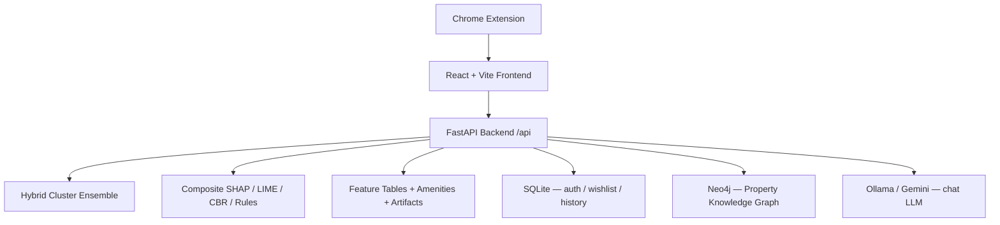

# PropertyLens

PropertyLens predicts Singapore HDB resale prices, ranks listings with location-aware signals, and surfaces interpretable model outputs (Composite SHAP, LIME, CBR comparables, Apriori rules) in a FastAPI backend and Vite/React frontend. A Neo4j knowledge graph powers natural-language property search via a local LLM.

> **Setting up for the first time?** Follow [`HOW_TO_RUN.md`](HOW_TO_RUN.md) for a complete step-by-step guide. The summary below is the 30-second version.

---

## Quick start

```bash
# 1. Clone + venv + deps
git clone <repository-url>
cd PropertyLens
python3.11 -m venv .venv && source .venv/bin/activate
pip install -r backend/requirements.txt
pip install jupyter notebook ipykernel huggingface_hub

# 2. Env
cp .env.example .env       # then edit: HF_TOKEN, NEO4J_*, JWT_SECRET

# 3. Pull artifacts (~1.5 GB) from Hugging Face
jupyter notebook download_artifacts_from_hf.ipynb        # run all cells

# 4. Seed Neo4j knowledge graph + SQLite app DB
jupyter notebook setup_neo4j_and_db.ipynb                # run all cells

# 5. Start Ollama (required — runs the chat LLM)
ollama serve & ollama pull gemma3

# 6. Frontend deps
cd frontend && npm install && cd ..

# 7. Run backend (terminal 1)
source .venv/bin/activate
cd backend && uvicorn main:app --reload --port 8000

# 8. Run frontend on port 5173 (terminal 2 — required for the Chrome extension)
cd frontend && npm run dev -- --port 5173 --strictPort
```

Open <http://localhost:5173>, log in as **`user`** / **`1234`**.

For the Chrome extension, see step 10 in [`HOW_TO_RUN.md`](HOW_TO_RUN.md).

---

## Prerequisites

| Tool | Required? | Purpose |
|---|---|---|
| Python 3.11+ | ✅ | sklearn 1.8 / XGBoost 3.2 model pickles need it |
| Node 18+ | ✅ | Vite + React frontend |
| Neo4j (AuraDB or Desktop) | ✅ for chat / Ask AI | Property knowledge graph |
| Ollama (`gemma3`) | ✅ for chat | Local LLM. Skip only if using Gemini fallback |
| Hugging Face token | ✅ | Pulls model + dataset artifacts on first setup |

---

## Architecture



### Repository layout

```
PropertyLens/
├── backend/                              # FastAPI app
├── frontend/                             # Vite + React UI
├── extension/                            # Chrome extension (PropertyGuru deep-link)
├── notebooks/                            # Training, XAI, RAG pipelines
├── scripts/                              # CLI tools (rule miner, retrain, CBR rebuild)
├── data/
│   ├── artifacts/                        # ← from HF (gitignored)
│   ├── feature_data/                     # ← from HF (gitignored)
│   ├── amenities/                        # in-git fixtures (small CSVs)
│   └── propertylens.db                   # SQLite — created by setup notebook
├── hf_data/05_photo_layer/artifacts/     # ← from HF (photo condition model)
├── docs/                                 # Architecture / methodology
├── HOW_TO_RUN.md                         # ⬅ start here
├── .env.example                          # env-var template
├── upload_artifacts_to_hf.ipynb          # publish artifacts to HF (admin)
├── download_artifacts_from_hf.ipynb      # pull artifacts from HF
└── setup_neo4j_and_db.ipynb              # seed Neo4j + SQLite + demo user
```

---

## Backend overview

Entry point: `backend/main.py`. Loads artifacts at startup into a shared `state` (model bundle, SHAP caches, rules, CBR data, composite SHAP, cluster profiles).

Routers (all mounted under `/api`):

| Group | Endpoint highlights |
|---|---|
| Prediction | `POST /api/predict` — price + confidence + debug + location |
| Explainability | `POST /api/explain/shap`, `POST /api/explain/composite-shap`, `POST /api/explain/lime`, `POST /api/cbr/similar`, `POST /api/counterfactual`, `GET /api/rules` |
| Analytics | `GET /api/analytics/trends`, `GET /api/analytics/global-shap?source=composite|tree-only` (returns Composite TreeSHAP by default) |
| Location | `GET /api/geocode`, `GET /api/nearby` |
| Chat / search | `POST /api/chat` (Neo4j-backed Q&A), `POST /api/property-search-chat` (NL property search streaming) |
| Photo | `POST /api/predict/condition-photo` (EfficientNet-B0 condition score) |
| Persistence | `/api/history/*`, `/api/wishlist/*` |
| Auth | `/api/auth/*` (JWT, demo user `user` / `1234`) |

---

## Frontend overview

Core views under `frontend/src/views/`:

- **`BuyerView.jsx`** — predict + Composite SHAP + CBR + map + offer planner. Includes the floating "Plan your offer" CTA that opens `BuyerOfferPlannerCard` (Step 5).
- **`SellerView.jsx`** — predict + asking-price recommendation card + what-if + counterfactual + offer-handler card with live verdict and dynamic counter-offer math.
- **`ShortlistView.jsx`** — Versus head-to-head: apple-to-apple filter, AI-vs-asking comparison, slot-coloured map pins, full-height map with highways and amenity radii.
- **`AnalysisView.jsx`** — full-width waterfall SHAP chart, Composite TreeSHAP by default, cluster filter with human-readable labels (e.g. "Cluster 2 — Central high-floor premium flats").
- **`PropertySearchAIView.jsx`** — natural-language property search using the Neo4j knowledge graph + LLM.

Shared API client: `frontend/src/api/client.js`.

---

## Model + XAI

**Hybrid Cluster Ensemble** (`backend/composite_treeshap.py` + `backend/hybrid_inference.py`):
- K-means routes each flat to one of 4 clusters
- Per-cluster stack: Ridge + XGBoost + LightGBM + RandomForest
- Linear meta-learner blends the four with weights `[w_ridge, w_xgb, w_lgb, w_rf]`

**Composite TreeSHAP** (the default served by `/api/analytics/global-shap` and Buyer view's SHAP panel):
- TreeSHAP for each tree learner per cluster
- Combined as `phi = w_xgb·sv_xgb + w_lgb·sv_lgb + w_rf·sv_rf` using meta-weights
- Ridge component is reported as a small reconciliation gap (~5–7% of signal)

**Other XAI surfaces**:
- LIME local explanations (per-instance, used in Debug view)
- CBR (Case-Based Reasoning) — BallTree over a feature subset, returns 3 most-similar past sales
- Apriori + surrogate decision-tree rules — surfaced as "How it fits market patterns"

---

## Notebooks

| Notebook | What it does |
|---|---|
| `download_artifacts_from_hf.ipynb` | Pulls model + dataset artifacts into `data/` (run on fresh clone) |
| `setup_neo4j_and_db.ipynb` | Seeds Neo4j knowledge graph + SQLite tables + demo user |
| `upload_artifacts_to_hf.ipynb` | Publishes artifacts back to Hugging Face (admin) |
| `notebooks/04_xai_layer/04_hybrid_xai_train.ipynb` | Trains LIME explainer + global SHAP cache |
| `notebooks/04_xai_layer/06_kernel_shap.ipynb` | KernelSHAP baseline (slow, ground-truth comparator) |
| `notebooks/04_xai_layer/07_composite_treeshap.ipynb` | Builds composite TreeSHAP global importance + cluster profiles |
| `notebooks/04_xai_layer/08_permutation_importance.ipynb` | Permutation-importance sanity check |
| `notebooks/05_photo_layer/02_photo_model_train.ipynb` | Fine-tunes EfficientNet-B0 for photo condition scoring |
| `notebooks/06_search_layer/01_build_knowledge_base.ipynb` | Builds the property knowledge base + pushes to Neo4j (canonical source for the schema) |

---

## Documentation

- **[`HOW_TO_RUN.md`](HOW_TO_RUN.md)** — full setup guide for fresh clones (read this first)
- **[`.env.example`](.env.example)** — template for all environment variables
- **`backend/README.md`** — backend-specific troubleshooting (libomp on macOS, LIME imports, etc.)
- **`docs/views-developer-guide.md`** — Buyer / Seller / Shortlist behaviour and API usage from the frontend
- **`docs/xai-shap-methods.md`** — comparison of SHAP variants (Tree-only, Composite, KernelSHAP)
- **`extension/README.md`** — Chrome extension scrape contract

---

## Notes on SHAP base values

The hybrid model uses cluster-specific TreeExplainers, so `base_value` from local SHAP is the **average prediction within that cluster**, not nationally. The four cluster profiles (auto-derived in `cluster_profiles.json`):

| Cluster | Profile | Avg price |
|---|---|---|
| 0 | Newer suburban larger flats (Sengkang, Punggol, Tampines) | ~$593k |
| 1 | Older compact mature-estate flats (Bedok, AMK, Bukit Batok) | ~$400k |
| 2 | Central high-floor premium flats (Kallang, Bukit Merah, Toa Payoh) | ~$642k |
| 3 | Outlying larger flats far from MRT (Woodlands, Yishun, Jurong West) | ~$465k |

`BaselineContextPanel` in `frontend/src/components/buyer/BuyerEstimateInsights.jsx` uses these profiles to label the baseline correctly per flat. If the model is retrained, regenerate `cluster_profiles.json` via `notebooks/04_xai_layer/07_composite_treeshap.ipynb`.

---

## Goals

- Predict HDB resale prices using transaction history, POIs, schools, and accessibility features.
- Explain every prediction with multiple lenses (Composite SHAP, LIME, comparables, market-pattern rules).
- Help buyers, sellers, and shortlist curators make better decisions through preference-aware ranking and natural-language search.
